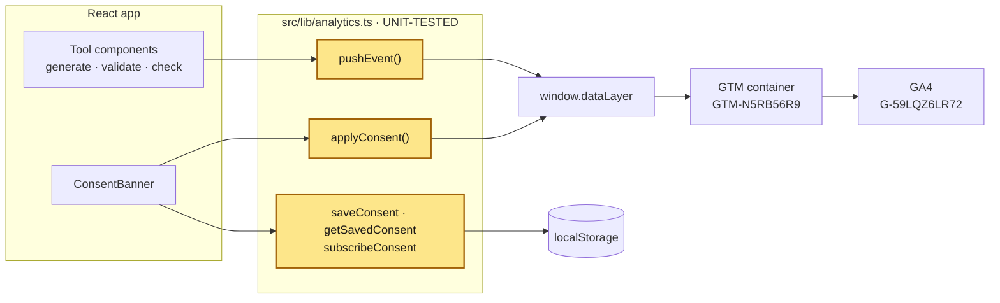
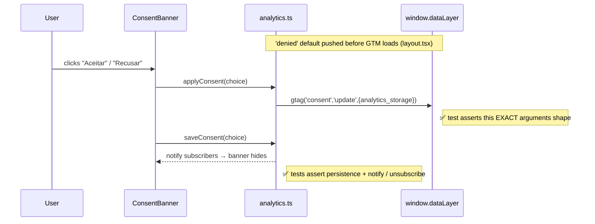
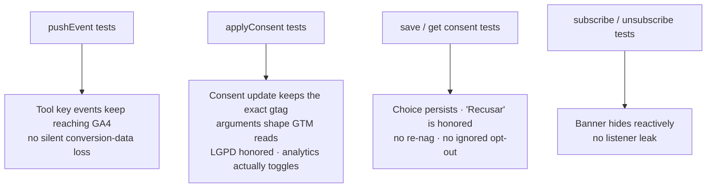

# Record — why the analytics/consent helper is unit-tested

> Status: **adopted** · 2026-07-13 · scope: [`src/lib/analytics.ts`](../src/lib/analytics.ts)
> Companion to [`measurement-plan.md`](measurement-plan.md) and
> [`gtm-container-setup.md`](gtm-container-setup.md).

## TL;DR

`src/lib/analytics.ts` is the **single point every analytics and consent signal
passes through**. When it breaks, it breaks *silently* — no exception, no
crash, no visible change on the page. You would only notice weeks later, as
wrong GA4 data or an ignored LGPD opt-out. Nine fast [Vitest](https://vitest.dev)
unit tests freeze the contracts a refactor could quietly violate, and CI blocks
any merge that breaks them (*"CI blocks deploys that break SEO"*, CLAUDE.md §8).

---

## 1. Where the tested code sits

Every custom event and every consent change funnels through the helper before
it reaches GTM. Components are forbidden from touching `window.dataLayer`
directly (CLAUDE.md §7.2), so guarding this one file guards the whole app-side
pipeline.



---

## 2. Why test it — the reason

The whole case is that these bugs are **invisible at runtime**. Nothing throws;
the page looks identical. Only a test (or a much later data audit) catches them.

| If this quietly broke… | Why it's silent | What it costs | Test that catches it |
|---|---|---|---|
| `pushEvent` overwrote instead of appending, or skipped lazy-init | Page renders fine; events just never arrive | Tool **key events** vanish from GA4 → lost conversion data (Objective O5) | `pushEvent` tests |
| `applyConsent` pushed the wrong shape | GTM ignores an unrecognized push; no error | Consent never toggles → **analytics dead, or fires against consent (LGPD)** | `applyConsent` tests |
| Consent stopped persisting / honored bad values | Banner still works on the surface | Banner re-nags every visit, or a saved **"Recusar" is ignored** | `saveConsent`/`getSavedConsent` tests |
| Subscriber notify/unsubscribe regressed | Subtle | Banner won't hide reactively, or a listener leaks | `subscribeConsent` tests |

---

## 3. The consent contract the tests pin

The high-stakes, easy-to-miss detail: `applyConsent` pushes the **`arguments`
object** `['consent','update',{ analytics_storage }]` — *not* a plain array or
object. That `arguments` shape is the only thing GTM's `gtag` reads. A
well-meaning "cleanup" that changed it would make GTM **silently ignore the
consent update**. The test freezes that exact shape.



---

## 4. What each test guards



### The 9 tests

| Group | Tests | Asserts |
|---|---|---|
| `pushEvent` | 2 | lazy-inits `dataLayer` when absent; **appends** without clobbering existing entries |
| `applyConsent` | 2 | pushes `['consent','update',{analytics_storage:'granted'}]` and the `'denied'` variant, as an `arguments` object |
| `saveConsent` / `getSavedConsent` | 3 | round-trips through `localStorage`; returns `null` when unset; returns `null` for an unrecognized stored value |
| `subscribeConsent` | 2 | notifies subscribers on save; **stops** notifying after unsubscribe |

---

## 5. What these tests do **not** cover

Unit tests prove the app emits the right shapes into a *fake* `dataLayer`, in
milliseconds. They deliberately do not prove Google receives or honors anything
— that is a different layer, verified differently.

| Layer | Question it answers | Status |
|---|---|---|
| **Unit — Vitest (this record)** | Does the helper emit the correct shapes / persist correctly? | ✅ in CI, every push & PR |
| **Live browser / GA4 DebugView** | Do GTM & GA4 actually receive it and respect consent (`gcs=G100/G101`, no cookies while denied)? | ✅ verified manually 2026-07-13 |
| **Playwright + Lighthouse** | Rendered banner behavior, SEO invariants per route, Core Web Vitals budgets | ⏳ roadmap (CLAUDE.md §8) |

---

## 6. Run it

```bash
npm test          # vitest run — one-shot (what CI runs)
npm run test:watch  # vitest — watch mode while developing
```

Config: [`vitest.config.ts`](../vitest.config.ts) (jsdom environment, `@/`
alias). Tests: [`src/lib/analytics.test.ts`](../src/lib/analytics.test.ts).
